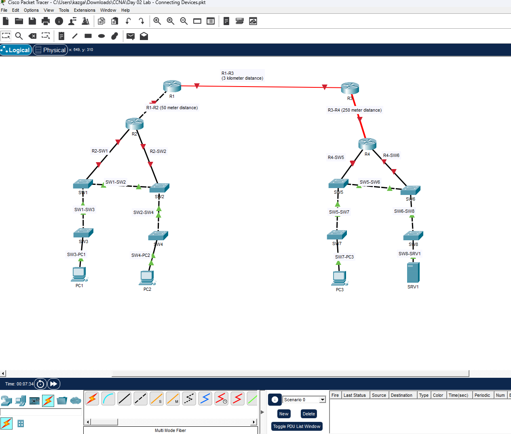

# CCNA Day 2 Lab – Connecting Network Devices with Correct Cable Types

---

## Overview

This lab focuses on selecting and applying the correct cable type for each device connection in a multi-router, multi-switch enterprise topology. With Auto MDI-X disabled, the correct straight-through, crossover, or fiber cable must be manually selected for each link based on the devices being connected and the distance between them. All connections were labeled in the topology and verified through Packet Tracer link indicators.

---

## Environment

| Tool | Purpose |
|------|---------|
| Cisco Packet Tracer | Network simulation and cable type practice |
| Cisco Routers (x4) | R1, R2, R3, R4 — inter-network routing |
| Cisco Switches (x8) | SW1 through SW8 — LAN switching |
| PCs (x3) | PC1, PC2, PC3 — end user workstations |
| Server (x1) | SRV1 — branch server |
| GitHub | Documentation and version control |

---

## Network Topology

*CCNA Day 2 Lab — full topology showing all routers, switches, PCs, and server connected with correct cable types per distance and device role*

---

## Cable Type Reference

| Connection Type | Cable Used | Reason |
|----------------|-----------|--------|
| Router to Router (same layer) | Crossover | Like devices |
| Router to Switch | Straight-through | Different devices |
| Switch to Switch (same layer) | Crossover | Like devices |
| Switch to PC | Straight-through | Different devices |
| Switch to Server | Straight-through | Different devices |
| R1 to R3 (3 km distance) | Single-Mode Fiber | Long distance over 1km |
| R3 to R4 (250 meter distance) | Multi-Mode Fiber | Short-medium fiber distance |
| R1 to R2 (50 meter distance) | Copper Crossover | Short distance, router-to-router |

---

## Connection Map

### Left Side — New York / Site A

| Label | Connection | Cable Type |
|-------|-----------|-----------|
| R1-R2 | R1 to R2 (50m) | Copper Crossover |
| R2-SW1 | R2 to SW1 | Straight-through |
| R2-SW2 | R2 to SW2 | Straight-through |
| SW1-SW2 | SW1 to SW2 | Crossover |
| SW1-SW3 | SW1 to SW3 | Crossover |
| SW2-SW4 | SW2 to SW4 | Crossover |
| SW3-PC1 | SW3 to PC1 | Straight-through |
| SW4-PC2 | SW4 to PC2 | Straight-through |

### Center — WAN Link

| Label | Connection | Cable Type |
|-------|-----------|-----------|
| R1-R3 | R1 to R3 (3km) | Single-Mode Fiber |

### Right Side — Tokyo / Site B

| Label | Connection | Cable Type |
|-------|-----------|-----------|
| R3-R4 | R3 to R4 (250m) | Multi-Mode Fiber |
| R4-SW5 | R4 to SW5 | Straight-through |
| R4-SW6 | R4 to SW6 | Straight-through |
| SW5-SW6 | SW5 to SW6 | Crossover |
| SW5-SW7 | SW5 to SW7 | Crossover |
| SW6-SW8 | SW6 to SW8 | Crossover |
| SW7-PC3 | SW7 to PC3 | Straight-through |
| SW8-SRV1 | SW8 to SRV1 | Straight-through |

---

## Build Walkthrough

---

### ✅ Step 1 — Identified Cable Requirements for Each Link

Reviewed all labeled connections in the topology and determined the correct cable type for each link based on two rules with Auto MDI-X disabled:

**Rule 1 — Like devices use crossover cables:**
- Router to Router
- Switch to Switch

**Rule 2 — Unlike devices use straight-through cables:**
- Router to Switch
- Switch to PC
- Switch to Server

**Rule 3 — Fiber for distance:**
- Under 100 meters: Copper
- Up to 550 meters: Multi-Mode Fiber
- Over 550 meters / long distance: Single-Mode Fiber

---

### ✅ Step 2 — Applied Fiber Cables for Long-Distance WAN Links

Connected R1 to R3 using **Single-Mode Fiber** — the 3 kilometer distance exceeds multi-mode fiber's maximum range and requires single-mode for long-haul transmission. Connected R3 to R4 using **Multi-Mode Fiber** — the 250 meter distance is within multi-mode fiber range and does not require single-mode.

---

### ✅ Step 3 — Applied Copper Crossover Cables for Like-Device Links

Connected all router-to-router and switch-to-switch links using copper crossover cables. R1 to R2 (50 meter distance) used copper crossover. All switch-to-switch connections (SW1-SW2, SW1-SW3, SW2-SW4, SW5-SW6, SW5-SW7, SW6-SW8) used copper crossover.

---

### ✅ Step 4 — Applied Straight-Through Cables for Unlike-Device Links

Connected all router-to-switch, switch-to-PC, and switch-to-server links using straight-through cables. Green link indicators on switch-to-end-device connections confirmed active links. Red indicators on router-to-router and router-to-switch links confirm interfaces are administratively down pending IP configuration — expected at this stage.

---

## Skills Demonstrated

| Skill | How It Was Applied |
|-------|--------------------|
| Cable Type Selection | Correctly identified straight-through, crossover, and fiber for each link |
| Physical Layer Knowledge | Applied OSI Layer 1 concepts to real device connections |
| Fiber Distance Rules | Selected single-mode vs multi-mode based on distance requirements |
| Auto MDI-X Awareness | Applied manual cable selection rules as if Auto MDI-X is disabled |
| Topology Reading | Interpreted labeled connection diagram and executed all links correctly |
| Cisco Packet Tracer | Used manual cable selection tools to apply correct cable per link |

---

## Lessons Learned

**Cable type selection is a Layer 1 skill that still matters.** Modern switches with Auto MDI-X automatically detect and correct cable type, so crossover cables are rarely needed in practice today. But understanding why crossover cables exist — and when they are required — is tested on the CCNA exam and reflects a deeper understanding of how signals flow between devices at the physical layer.

**Fiber distance rules are not arbitrary.** Multi-mode fiber uses a larger core that allows multiple light paths, which causes signal dispersion over long distances — limiting it to roughly 550 meters depending on the standard. Single-mode fiber uses a smaller core with a single light path, eliminating dispersion and enabling kilometer-scale transmission. Choosing the wrong fiber type for the distance results in signal loss and link failure.

**Red link indicators are expected on unconfigured interfaces.** Every router interface in this lab shows red because no IP addresses have been assigned yet. A physical connection exists but the interface is administratively down. This is normal at the cabling stage and would be resolved in the next lab when IP addressing is configured.

---

## 💼 Real-World Application

Physical layer knowledge is the foundation of every network troubleshooting workflow. When a link is down, the first question is always whether the physical connection is correct — the right cable, the right port, the right transceiver. Network engineers working in data centers, server rooms, and branch deployments need to know when to use copper vs fiber, straight-through vs crossover, and single-mode vs multi-mode. These decisions are made during initial deployments and during fault isolation when links go down unexpectedly.

---

## References

- [Jeremy's IT Lab — CCNA Day 2](https://www.youtube.com/watch?v=iR0UMUhe6J4)
- [Jeremy's IT Lab — Full CCNA Course](https://www.youtube.com/playlist?list=PLxbwE86jKRgMpuZuLBivzlM8s2Dk5lXBQ)
- [Cisco Packet Tracer Download](https://www.netacad.com/courses/packet-tracer)
